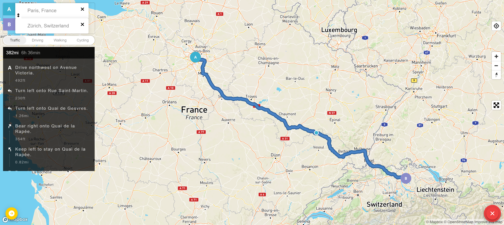
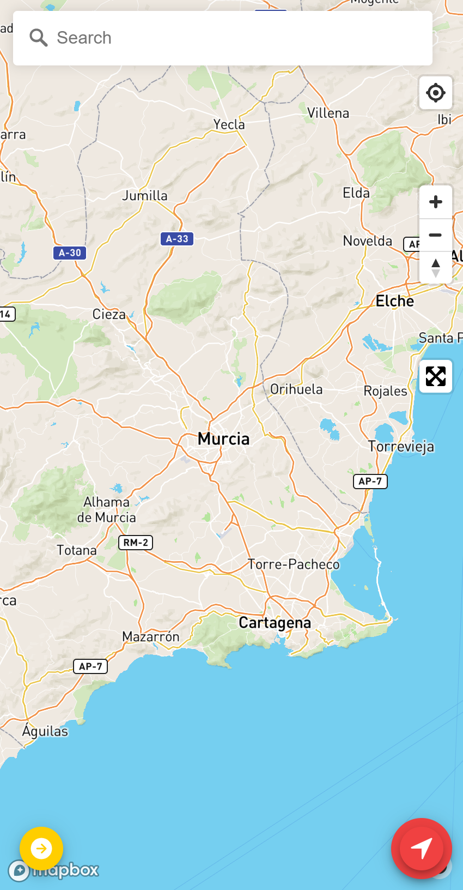
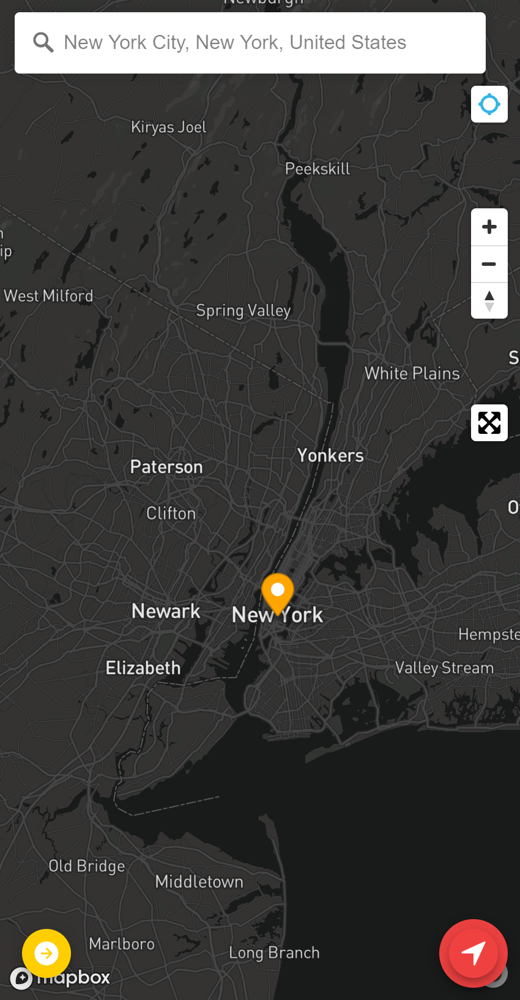
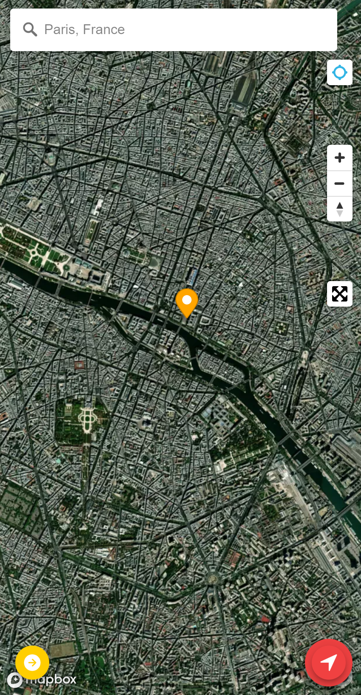
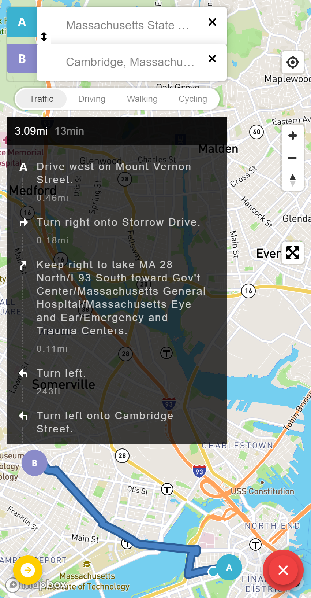
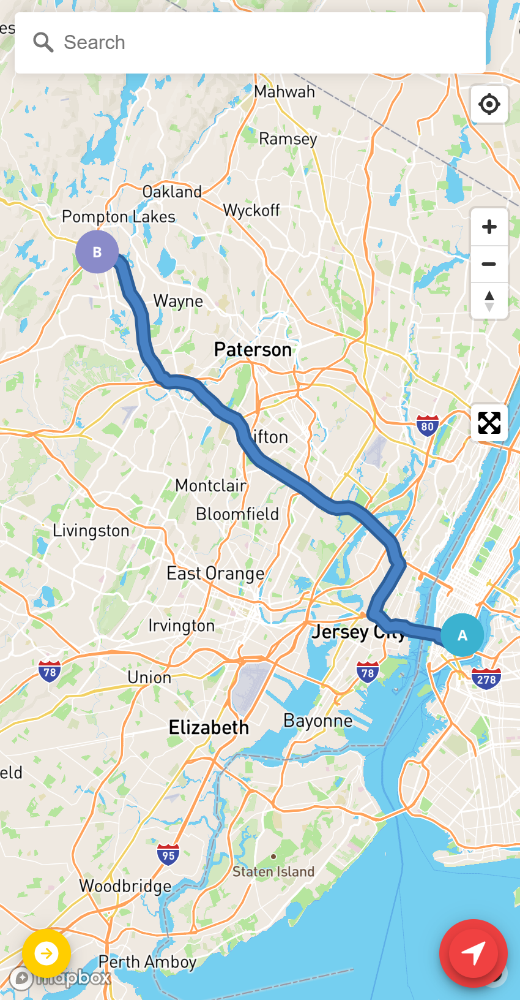
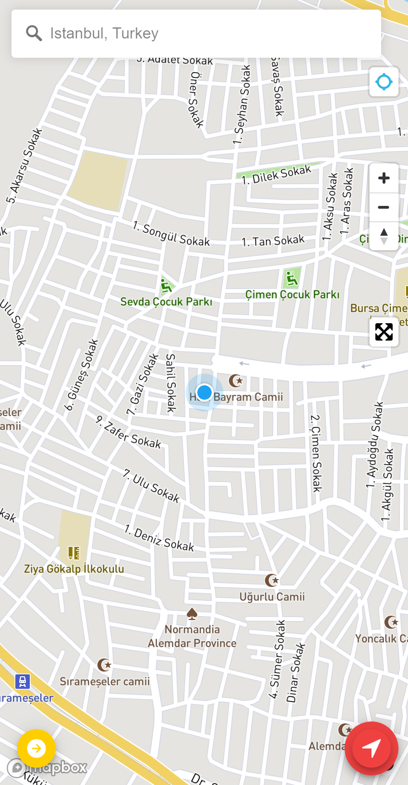

<h1 align="center">IonMaps 🗺️ GPS, Maps and Directions </h1>
<p align="center">IonMaps - GPS, Maps and Directions, is a cross-platform mobile application made by integrating Mapbox GL JS with Ionic-Angular. </p> 

<p align="center">
  <a href="https://github.com/enessfk/IonMaps/issues">Report Bug</a> · 
  <a href="https://github.com/enessfk/IonMaps/issues">Request Feature</a>
</p>

## About

This project, which was carried out within the scope of application development with Ionic Framework, includes many features such as Geocoding and Navigation Directions, which are more advanced features, as well as basic features in maps application.

<p>

</p>

### Features
Some of the many features the project includes:

- Geocoding control, enabling users to search the map for a place. - ( forward geocoding and reverse geocoding )
- Switchable map style - ( Street, Dark, Satallite )
- Navigation directions between origin and destination
- Clickable map control that enables a user to toggle fullscreen mode on and off.
- Zoom and rotation controls
- Smooth interpolation between locations
- English localization of geocoder
- Marking the location of the search result with marker
- Geolocating the user and then tracking their current location on the map

### Built with

- [Ionic v5](https://ionicframework.com/docs) - Ionic Framework is the open-source mobile app development framework that makes it easy to build top quality native and progressive web apps with web technologies. 
- [Angular v11](https://angular.io/) - Angular is a TypeScript-based free and open-source web application framework led by the Angular Team at Google and by a community of individuals and corporations.
- [TypeScript](https://www.typescriptlang.org/) - TypeScript is a programming language developed and maintained by Microsoft. It is a strict syntactical superset of JavaScript and adds optional static typing to the language. 
- [Mapbox](https://www.mapbox.com/) - Mapbox is a location data platform that powers the maps and location services used in many popular apps.

<p align="center"> 
<a href="https://ionicframework.com/">
  
</a>&nbsp;
  
<a href="https://angular.io/">
  
</a>&nbsp;
  
<a href="https://www.typescriptlang.org/">
  
</a>&nbsp;

<a href="https://www.mapbox.com/">
  
</a>&nbsp;
</p>  

## Getting Started

The following instructions will get you a copy of the project up and running on your local machine for development and testing purposes.
  
### Prerequisites

You either need your own tile server such as the one provided by [openmaptiles.org](https://openmaptiles.org) or a Mapbox API access token ( they have a free Starter plan! ), so [sign up with Mapbox](https://www.mapbox.com/signup/).
Once you've registered go to your Account > Apps > New token. The 'Default Secret Token' is what you'll need.

You will also need to set up your development environment. To import the access token you created into the project, open the [environment.ts](./src/environments/environment.ts) file and type the access token:

```typescript
//.src/environment/environment.ts

export const environment = {
  mapbox: {
    accessToken: 'YOUR-MAPBOX-ACCESS-TOKEN',
  }
};
```
After importing your own token into the development environment, to run this project in production or development mode you have to make sure, `ionic` and `cordova` are installed globally on your computer. 

Before proceeding, also check if [Node.js](https://nodejs.org/en/) (bundled with [npm](https://www.npmjs.com/)) is installed. It is recommended to select the LTS version to ensure best compatibility.

- To check if it is installed:
```bash
node --version
npm --version
```
- Install ionic and cordova command line interface globally:
 ```bash
npm install -g ionic cordova
```
### Installation

To get this project, clone the repository directly using git or download a zip copy from the [master branch on Github](https://github.com/enessfk/IonMaps/archive/refs/heads/master.zip). 

```bash
git clone https://github.com/enessfk/IonMaps.git IonMaps
```

To install the dependencies, run this in the application folder from the command-line:

```bash
npm install
```

### Running the app in your browser:

```bash
ionic serve
```
### Running the app on your device:

Add an iOS or Android platform to the project:

```bash
ionic cordova platform add ios 
# or 
ionic cordova platform add android
```

Run the app on your device:

```bash
ionic cordova run ios
# or
ionic cordova run android
```

*For further information please read [ionic's deployment guide](https://ionicframework.com/docs/intro/deploying/).*

## Screenshots

<p>
   &emsp;
   &emsp;
  
</p>  
<p>
   &emsp;
   &emsp;
  
</p>


## Contributing
Want to contribute? Great!
To fix a bug or enhance an existing module, follow these steps:

1. Fork the Project
2. Create your Feature Branch (`git checkout -b feature/enhanced-feature`)
3. Commit your Changes (`git commit -m 'Add some enhanced-feature'`)
4. Push to the Branch (`git push origin feature/enhanced-feature`)
5. Open a Pull Request

## License

Distributed under the MIT License. See `LICENSE` for more information.

